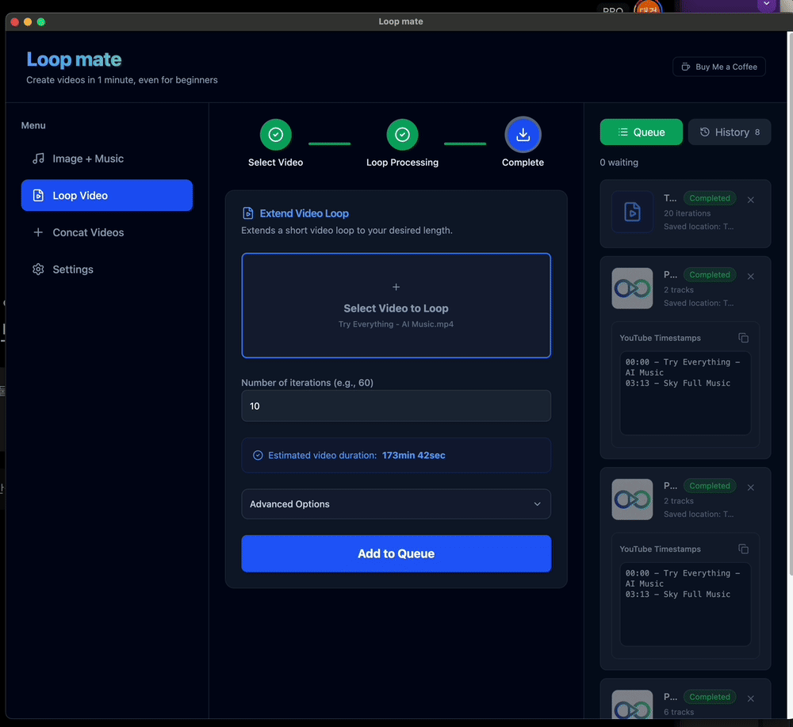
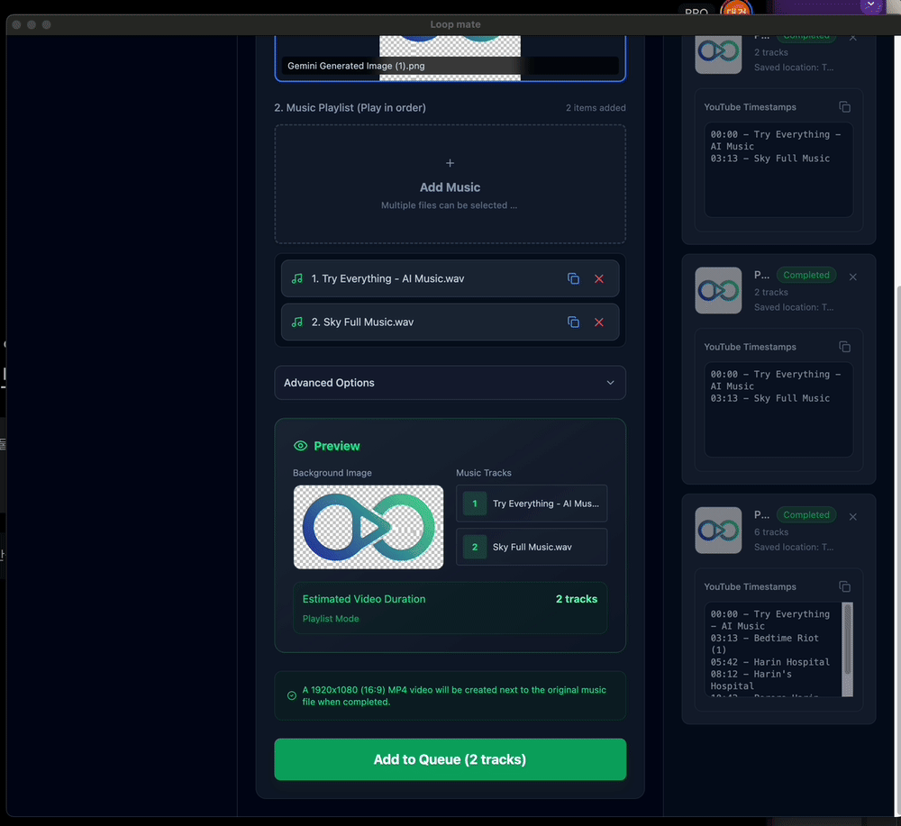

# LoopMate

> **Create High-Quality Loop Videos for AI Music (Suno, Udio, etc.) in SECONDS.**
> *Stop waiting for rendering. Start creating.*

  
  
<strong>Create 10x videos in just 5 seconds</strong>

  
  
  
<strong>Create playlists with just buttons</strong>

  
  
  
  

**LoopMate** is a lightning-fast desktop app that transforms AI music files into high-quality loop videos. Whether you need a 3-minute track or a 10-hour seamless loop, LoopMate delivers results in seconds, not minutes.

**🌐 Languages:** English | 한국어 (아래로 스크롤) | Supported Languages (아래로 스크롤)

---

## 📥 Download

| Platform | Download |
|:--------:|:--------:|
| 🍎 **macOS** | [Download .dmg](https://github.com/dgdev22/loopmate/releases/latest) |
| 🪟 **Windows** | [Download Setup.exe](https://github.com/dgdev22/loopmate/releases/latest) |

*v1.0.0 • 100% Free • No Watermarks*

> "I built this because I was tired of waiting 30 minutes for a simple loop video. Now, it's done before I can even take a sip of coffee." — *dgdev22 (Dad Developer)*

---

## ✨ Key Features

### 🎯 3 Core Functions

1. 🎬 **Image + Music → Video**: Convert an image and audio into a 16:9 YouTube video. **Avg. Time: 3s** ⚡
2. 🔁 **Infinite Loop**: Extend any short video to 1 hour, 10 hours, or more with seamless transitions.
3. 📹 **Smart Concat**: Merge multiple videos with automatic audio normalization and fade effects.

### 🎥 YouTube Timestamps
LoopMate automatically generates chapter timestamps when you merge multiple songs

### 📺 Watch It in Action
See how easy it is to create a playlist with 6 songs in just 19 seconds:

---

## 🔒 Installation & Security

### 🍎 macOS Users (Important)
LoopMate is an open-source project. Currently, I haven't paid Apple's $99/year fee, so you may see a "Developer cannot be verified" warning.

**How to run safely:**
1. Move the app to your **Applications** folder.
2. **Right-click** (Control-click) the app and select **Open**.
3. Click **Open** again in the dialog. (This is only required once).

### 🪟 Windows Users
If Windows Defender shows a warning, click **"More info"** → **"Run anyway"**.

---

## 🚀 Supporting a Dad Developer

LoopMate is a personal project built between diaper changes and bedtime stories. I want to keep this tool free and open-source forever.

### 🙏 Support This Project
If LoopMate saved your time, please consider supporting its development:

- ⭐ **Star this repo**: The easiest way to support and stay updated!
- 💖 **[GitHub Sponsors](https://github.com/sponsors/dgdev22)**: Support long-term maintenance and development.
- ☕ **[Buy Me a Coffee](https://buymeacoffee.com/loopmateapp)**: Quick one-time support (helps cover Apple's $99/year developer fee 🍎)

> Your support keeps LoopMate free and open-source forever.
---

## 🛠️ Behind the Code (Vibe Coding)

This app was built using **"Vibe Coding"**—leveraging AI to solve real-world problems quickly. I'm a backend developer by trade, but I needed this tool for my own AI music, so I built it. It’s not about perfect code; it’s about **making things that work.**

- **Tech Stack**: Electron, React, TypeScript, Tailwind CSS, FFmpeg.
- **Contribution**: Bug reports and PRs are always welcome! See [CONTRIBUTING.md](CONTRIBUTING.md).

### 🌍 Supported Languages (15+) {#supported-languages-15}

LoopMate is built for the global creator community. We currently support:

- 🇺🇸 **English** (en) | 🇰🇷 **한국어** (ko) | 🇯🇵 **日本語** (ja)
- 🇨🇳 **简体中文** (zh) | 🇪🇸 **Español** (es) | 🇫🇷 **Français** (fr)
- 🇩🇪 **Deutsch** (de) | 🇧🇷 **Português** (pt) | 🇷🇺 **Русский** (ru)
- 🇮🇳 **हिन्दी** (hi) | 🇸🇦 **العربية** (ar) | 🇮🇩 **Bahasa Indonesia** (id)
- 🇻🇳 **Tiếng Việt** (vi) | 🇹🇭 **ภาษาไทย** (th) | 🇮🇹 **Italiano** (it)

---

# LoopMate (한국어 Korean)

> **Suno AI, Udio 등 AI 음악 크리에이터를 위한 초고속 무한 루프 비디오 생성기**

**LoopMate**는 AI 음악 파일을 단 몇 초 만에 고품질 유튜브 영상으로 변환해 주는 데스크톱 앱입니다. 1시간 이상의 장시간 루프 영상도 인코딩 기다림 없이 즉시 생성하세요.

## ✨ 핵심 기능

1. 🎬 **이미지 + 음악 결합**: 이미지 한 장과 오디오를 합쳐 유튜브용 16:9 영상 생성 (**평균 3초 소요** ⚡)
2. 🔁 **무한 루프 생성**: 짧은 영상을 1시간, 10시간 등 원하는 길이로 끊김 없이 반복 확장
3. 📹 **비디오 병합 (Concat)**: 여러 영상을 하나로 합치고 볼륨 정규화 및 페이드 효과 적용
4. 🎯 **유튜브 타임스탬프 자동 생성**: 여러 곡을 합치면 유튜브 설명란에 바로 붙여넣을 수 있는 타임스탬프가 자동으로 생성됩니다.

### 📺 실제 사용 영상
6개 곡으로 플레이리스트를 단 19초만에 만드는 모습을 확인하세요:

## 📥 설치 방법 (macOS 사용자 필독)

개인 개발자가 무료로 배포하는 앱이라 Apple 정식 서명이 없습니다. 실행 시 보안 경고가 뜨면 당황하지 마세요!

**해결 방법:**
1. 앱을 `응용 프로그램` 폴더로 옮깁니다.
2. 앱 아이콘을 **우클릭**한 뒤 **'열기'**를 선택합니다.
3. 팝업창에서 다시 한번 **'열기'**를 누르면 이후부터 정상 실행됩니다.

## 🙏 아빠 개발자 후원하기
LoopMate는 육아 짬짬이 만든 소중한 프로젝트입니다. 여러분의 후원은 앱을 정식 등록하여 보안 경고를 제거하고, 지속적으로 기능을 개선하는 힘이 됩니다.

- ⭐ **GitHub Star**: 스타 버튼 클릭은 개발자에게 가장 큰 응원이 됩니다!
- 💖 **[GitHub Sponsors](https://github.com/sponsors/dgdev22)**: 지속적인 개발을 위해 공식 후원자가 되어주세요.
- ☕ **[커피 한 잔 후원하기](https://buymeacoffee.com/loopmateapp)**: 하린이 우유값과 애플 개발자 등록비로 사용됩니다 🍼🍎

---

## ❓ FAQ

**Q: Why is it so fast?**  
A: Native FFmpeg processing instead of browser-based tools. Everything runs locally on your machine.

**Q: Is my data safe?**  
A: Yes! All processing happens on your computer. Your files are never uploaded to any server or cloud service.

**Q: Batch processing?**  
A: Yes! LoopMate supports batch processing. You can add multiple files to the queue and process them all at once.

**Q: Commercial use?**  
A: Yes! MIT license allows commercial use. Create and sell your content freely.

---

**Made with ❤️ by a dad developer for AI music creators**

[🐛 Report Bug](https://github.com/dgdev22/loopmate/issues) • [💡 Request Feature](https://github.com/dgdev22/loopmate/issues) • [💬 Discussions](https://github.com/dgdev22/loopmate/discussions)

